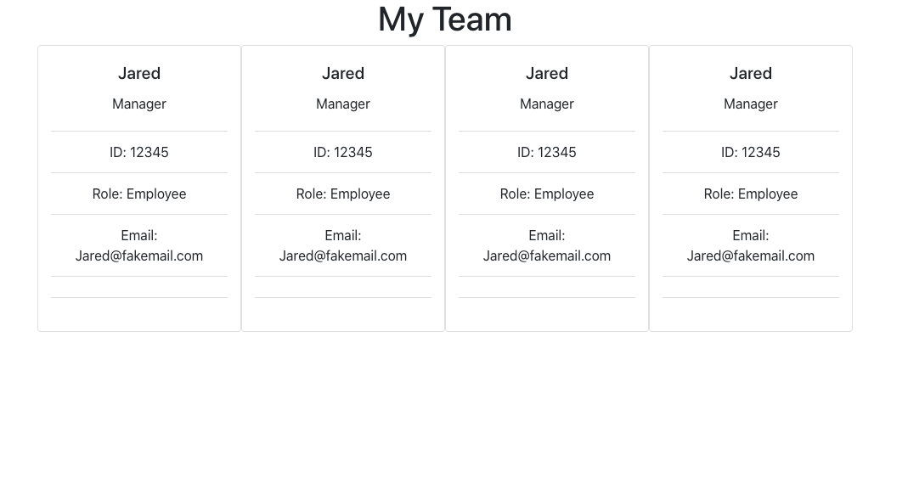

Team Profile Generator

## Description

Team Profile Generator, is a node.js application that is using object oriented programming (OOP) and Test-Driven Development, and has been consolidated and refactored using ES6 methodologies.

## Languages
* Node.JS
* NPM - Inquirer & Jest
* Javascript
* ES5/ES6 syntax
* OOP
* TDD

## Video Walkthrough
https://www.loom.com/share/1e919ab7c9f24443a8776f1def8dbbf9 

## Functionality
* Implemented test with Jest to verify proper oject creation and method usage

* Created test mock to eliminate dependencies on other modules

* Working command-line game using OOP structure

* Utilized built-in data types (ie. Arrays) to inherit their own methods

* Converted ES5 constructor functions to ES6 classes without interrupting test suites

* Implemented method and property inheritance using both ES5 and ES6 syntax

* Conditional logic to follow sequencing

## How to Run The Application

1.) Clone repository to a dedicated repository location on your local git or download files directly via zip file

2.) Open code in dedicated code editor

3.) Open root directory in terminal window

4.) Type NPM install to install dependencies (Inquirer and Jest)

5.) After dependencies are installed, type `npm start` in the terminal window, and application will run

## Referenced Image

